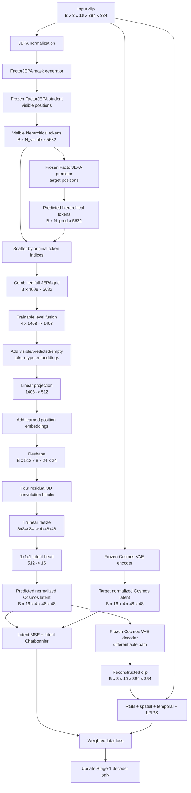
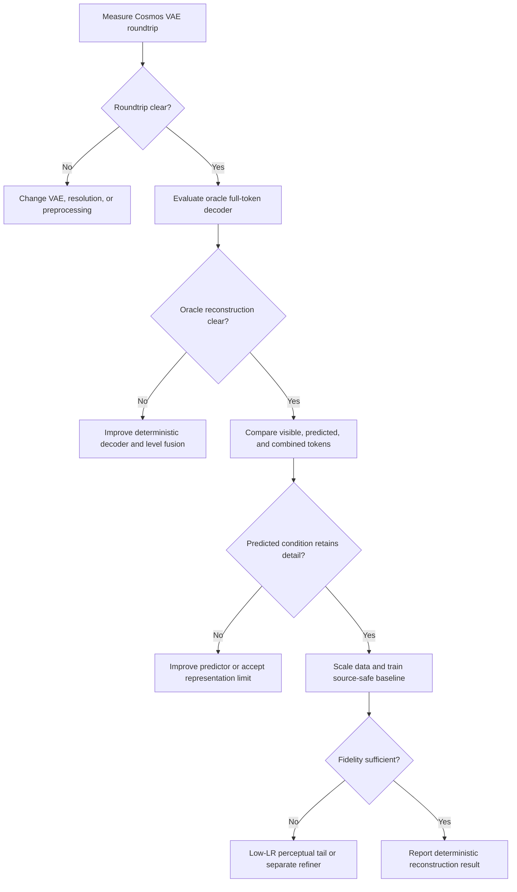

# Stage-1 FactorJEPA-to-Cosmos Video Reconstruction

## Architecture, current evidence, limitations, and roadmap

**Status:** active experiment  
**Current modality:** combined visible and predicted FactorJEPA tokens  
**Current training horizon:** 14,000 optimizer steps  
**Latest established result:** approximately 6,500 steps; training resumed from the
step-6,630 W&B checkpoint  
**W&B run:** [factorjepa-stage1/8ahcb0na](https://wandb.ai/aayush21003-indraprastha-institute-of-information-techno/factorjepa-stage1/runs/8ahcb0na)

## 1. Research objective

The experiment asks whether frozen FactorJEPA representations contain enough
information to reconstruct the source video.

Stage-1 learns a deterministic mapping:

```text
FactorJEPA visible tokens + FactorJEPA predicted tokens
    -> normalized Cosmos VAE latent
    -> frozen Cosmos VAE decoder
    -> reconstructed video
```

The experiment is deliberately narrower than video generation. It does not use
the Cosmos text encoder or diffusion transformer (DiT). Cosmos contributes only
its pretrained video VAE. This makes Stage-1 a relatively direct probe of the
information recoverable from FactorJEPA tokens: the trainable network must map
those tokens into the latent representation of the same video.

The current output is a reconstruction of the **complete 16-frame clip**, not
only the masked region. The target is the complete Cosmos latent produced from
the ground-truth video.

## 2. End-to-end architecture



## 3. Dimension flow

| Stage | Shape | Explanation |
|---|---:|---|
| Input | `B x 3 x 16 x 384 x 384` | RGB clip in `[0, 1]` |
| JEPA token grid | `8 x 24 x 24` | Tubelet 2 and spatial patch 16 |
| Total positions | `4608` | `8 * 24 * 24` |
| Per-level JEPA width | `1408` | ViT-g/1B encoder width |
| Hierarchical token width | `5632` | Four outputs concatenated: `4 * 1408` |
| Combined token grid | `B x 4608 x 5632` | Visible and predicted tokens restored to their positions |
| Fused tokens | `B x 4608 x 1408` | Learned weighted fusion of four JEPA levels |
| Projected tokens | `B x 4608 x 512` | Decoder working width |
| 3D feature grid | `B x 512 x 8 x 24 x 24` | Temporal-spatial layout restored |
| Resized feature grid | `B x 512 x 4 x 48 x 48` | Matched to Cosmos VAE latent resolution |
| Predicted latent | `B x 16 x 4 x 48 x 48` | Normalized Cosmos VAE latent |
| Reconstructed video | `B x 3 x 16 x 384 x 384` | Frozen VAE decoder output |

The Cosmos latent shape is checked at runtime rather than assumed silently. A
shape mismatch between the Stage-1 output and target latent raises an error.

## 4. Architecture choices and rationale

### 4.1 Frozen FactorJEPA student and predictor

Freezing both components isolates the decoder question. Improvement cannot be
attributed to the representation adapting to reconstruction; it must come from
learning to read the existing representation.

This is appropriate for testing representation sufficiency. It is not
necessarily the architecture that would maximize final video quality.

### 4.2 Combined visible and predicted tokens

Visible student tokens and predictor tokens are scattered back into their
original temporal-spatial positions. This preserves the `8 x 24 x 24` JEPA
geometry and gives the decoder both observed evidence and FactorJEPA's inferred
content.

The combined condition tests the usefulness of the complete FactorJEPA pathway,
but it does not isolate predictor quality. Recognizable output could be driven
mostly by visible tokens. Predicted-only, visible-only, and oracle-token
ablations are required before making a strong claim about predicted tokens.

### 4.3 Learned hierarchical level fusion

FactorJEPA returns four 1,408-dimensional hierarchical outputs. The decoder
normalizes each level and learns four scalar softmax weights, producing one
1,408-dimensional token per position.

This is parameter-efficient and prevents the 5,632-dimensional input from
making the decoder excessively large. Its limitation is that reducing four
levels to one weighted sum may discard complementary low-, mid-, and high-level
information.

### 4.4 Token-type and positional embeddings

The model adds a learned embedding identifying whether each position contains a
visible token, predicted token, or an unfilled token. A separate learned
position embedding preserves absolute position after tokens are scattered.

This lets the decoder treat direct observations differently from predictions
instead of assuming that both have identical reliability.

### 4.5 3D convolutional decoder

After projection to 512 channels, tokens are reshaped into a video grid and
processed with four residual 3D convolution blocks. The blocks jointly model
local spatial and temporal neighborhoods.

This decoder is deterministic, compact (approximately 59.7 million trainable
parameters), and straightforward to optimize. It is also shallow relative to
modern video decoders. Its single-resolution body and trilinear resizing are
likely contributors to loss of high-frequency detail.

### 4.6 Cosmos VAE latent target

Predicting a pretrained video latent is easier than directly synthesizing
384x384 RGB frames. It also provides a fixed decoder with learned video and
temporal priors.

The Cosmos VAE roundtrip is the reconstruction ceiling for this target. If an
encoded ground-truth video is already blurry after VAE decoding, Stage-1 cannot
recover details that the target representation discards.

### 4.7 No Cosmos DiT in Stage-1

Leaving out the DiT is intentional. A diffusion model may improve realism by
hallucinating plausible detail, but that would make it harder to determine
whether the detail was present in FactorJEPA tokens. The deterministic VAE path
is the cleaner first experiment.

## 5. Objective and gradient flow

Let `z_hat` be the predicted normalized Cosmos latent, `z` the target latent,
`x_hat` the decoded prediction, and `x` the input video. The current objective is:

```text
L = 1.00 * latent_mse
  + 0.10 * latent_charbonnier
  + 0.20 * rgb_charbonnier
  + 0.05 * spatial_gradient
  + 0.05 * temporal_difference
  + 0.05 * lpips
```

| Term | Purpose | Main limitation |
|---|---|---|
| Latent MSE | Accurate Cosmos latent values; stable primary supervision | Penalizes uncertainty by averaging and can favor blur |
| Latent Charbonnier | Robust latent matching with smooth L1-like gradients | Still a pointwise latent objective |
| RGB Charbonnier | Correct colors, brightness, layout, and coarse appearance | Pixel averaging can favor blur |
| Spatial gradient | Match horizontal and vertical edges | Does not guarantee realistic texture |
| Temporal difference | Match adjacent-frame changes and reduce static/flickering output | Only first-order, short-range motion |
| LPIPS | Improve perceptual and semantic similarity | Applied to four sampled frames; not inherently temporal |

The Cosmos VAE parameters remain frozen, but its decoder is not wrapped in
`no_grad` for the prediction branch. Pixel and perceptual gradients pass through
the frozen VAE and update the Stage-1 decoder. LPIPS is also frozen.

W&B records raw loss terms. Their plotted magnitudes are not their weighted
contributions to the total objective.

## 6. Data and validation protocol

The current experiment uses the first three TAR shards from
`anonymousML123/denseworld-115k_archive`, giving 3,000 selected clips:

| Partition | Clips | Use |
|---|---:|---|
| Train | 2,650 | Optimization |
| Validation | 50 | Periodic deterministic comparison |
| Test | 300 | Held out; not yet evaluated by the training script |

The manifest uses seed 42 and is reused by hash across resume. The filename
`data/splits/walkindia_first3_seed42.json` is historical; the active dataset is
DenseWorld.

Training masks are sampled rather than fixed. Each validation clip receives a
separate mask derived deterministically from its clip key, so masks are diverse
across clips but identical across checkpoints.

At batch size one:

```text
steps per epoch = 2650
validation interval = ceil(0.25 * 2650) = 663 steps
14,000 steps = approximately 5.28 epochs
```

A numbered checkpoint and the full `latest` checkpoint are saved at validation
boundaries. The `latest` artifact contains optimizer state and is the correct
resume source. Numbered checkpoints are model-only by default.

## 7. Current results

### 7.1 Qualitative result at approximately 6,500 steps

At step 0, Stage-1 reconstructions were close to unstructured noise. By roughly
6,500 steps, validation videos showed recognizable broad scene structure:

- major objects and scene elements could be identified;
- coarse layout and colors were being reconstructed;
- temporal content was no longer pure noise;
- fine detail, boundaries, and texture remained visibly blurry.

This is meaningful evidence that the combined frozen JEPA representation can be
mapped into a video-bearing latent space. It is not yet evidence of faithful
high-resolution reconstruction or held-out generalization.

### 7.2 Loss behavior

The available training and validation curves show:

- latent MSE and latent Charbonnier fell sharply early and continued to improve
  more slowly;
- validation RGB reconstruction loss improved substantially and then began to
  flatten;
- validation LPIPS improved consistently, indicating increasing perceptual
  similarity;
- temporal-difference loss remained comparatively flat and noisy;
- spatial-gradient loss was non-monotonic and showed a mid-run increase before
  partial recovery;
- total training loss became noisy around a lower plateau rather than diverging.

The loss behavior agrees with the videos: the decoder has learned coarse latent
and semantic structure, while high-frequency spatial and temporal detail is the
remaining weakness.

### 7.3 Resume status

The W&B `latest` checkpoint was step 6,630, while the original W&B metric stream
had reached step 6,693. Resuming from 6,630 correctly replays those updates; W&B
ignores the duplicate metric steps until the process passes 6,693.

The resumed scheduler is anchored at the checkpoint learning rate and decays
smoothly to zero at step 14,000. It does not jump upward merely because the
training horizon was extended from 10,000 to 14,000.

## 8. What the current result does and does not establish

### Supported by current evidence

1. The Stage-1 decoder has sufficient capacity to learn the mapping on one clip.
2. On the 2,650-clip training regime, combined JEPA tokens produce much more than
   noise and recover broad video structure.
3. Latent, RGB, and perceptual validation objectives improve with training.
4. The deterministic validation masks permit meaningful checkpoint comparison.

### Not yet established

1. Whether predicted tokens themselves contain enough detail; visible tokens may
   dominate the combined condition.
2. Generalization to unseen source videos.
3. Final performance on the 300-clip test partition.
4. Whether blur is primarily caused by FactorJEPA information loss, level fusion,
   decoder capacity, latent regression, or the Cosmos VAE ceiling.
5. Whether a perceptual-tail fine-tune improves detail without reducing fidelity.

## 9. Important limitations

### 9.1 Clip-level leakage risk

The present random split is deterministic but clip-level. DenseWorld TARs can
contain multiple neighboring clips from the same source video. Clips from one
source may therefore appear in both training and validation/test partitions,
making generalization look better than it is.

The next definitive experiment should assign complete source videos to one
partition before selecting clips.

### 9.2 Combined tokens confound representation sources

The decoder receives visible and predicted tokens simultaneously. This is a
useful reconstruction setting but cannot separate information supplied by the
student from information inferred by the predictor.

### 9.3 Losses encourage conditional averaging

Latent MSE and pixel reconstruction losses optimize a single deterministic
answer. When fine detail is uncertain or absent from JEPA tokens, averaging is a
natural optimum and appears as blur.

### 9.4 Coarse decoder topology

Four same-resolution Conv3D blocks followed by trilinear interpolation provide
limited multi-scale synthesis capacity. There are no progressive upsampling
blocks, U-Net skips, attention layers, or dedicated high-resolution refinement
stages.

### 9.5 Scalar level fusion is restrictive

Four hierarchical feature levels are collapsed using one global weight per
level. The preferred level may depend on token, location, motion, or decoder
stage; global scalar fusion cannot express that.

### 9.6 Validation cost and checkpoint selection

Generating two videos for each of 50 validation clips is expensive. The current
trainer saves periodic/latest/final checkpoints but does not yet maintain a
formally selected `best` checkpoint based on a declared validation metric.

### 9.7 Resume is not bit-for-bit deterministic

Model and optimizer state, split identity, and learning rate are restored. The
streaming data-loader position and all RNG states are not checkpointed, so a
resumed process restarts the data/mask sequence rather than reproducing the
interrupted process bit-for-bit.

## 10. Recommended next steps

### Priority 1: finish the 14,000-step baseline unchanged

Complete the current run with the existing loss weights. Changing weights in the
middle would make it difficult to determine whether improvement came from more
optimization or a different objective.

Select checkpoints using validation latent MSE and LPIPS together, and inspect
the same deterministic validation clips at every checkpoint. Do not assume the
final checkpoint is automatically best.

### Priority 2: establish the Cosmos VAE ceiling

For every validation/test clip, compare:

```text
input video
Cosmos encode -> Cosmos decode roundtrip
Stage-1 latent -> Cosmos decode reconstruction
```

Report PSNR, SSIM, LPIPS, latent error, and temporal-difference error. The gap
between Stage-1 reconstruction and VAE roundtrip is the recoverable Stage-1 gap.

### Priority 3: run information-source ablations

Train or evaluate matched conditions:

| Condition | Question |
|---|---|
| Oracle full student grid | Can the decoder reconstruct from complete JEPA encoder information? |
| Visible only | How much can be reconstructed directly from context? |
| Predicted only | How much information is present in predictor outputs? |
| Visible + predicted | What does the complete FactorJEPA pathway recover? |
| Shuffled predicted tokens | Does spatially aligned prediction matter? |

The oracle condition is particularly important. If oracle reconstruction is
also blurry, the decoder or representation is the bottleneck. If oracle is
clear but combined/predicted is blurry, predictor quality is the bottleneck.

### Priority 4: make the evaluation split source-video-safe

Regenerate train/validation/test manifests by grouping complete original videos.
Use the current clip-level run as a development result, not the definitive
generalization result.

### Priority 5: improve the deterministic decoder

The most promising architecture upgrade is a multi-scale latent decoder:

1. retain separate learned projections of all four JEPA levels;
2. fuse levels per token or per decoder stage rather than with four global
   scalars;
3. process the `8 x 24 x 24` grid with residual 3D blocks and temporal attention;
4. progressively map to `4 x 48 x 48` with learned spatial upsampling;
5. add coarse-to-fine residual heads and skip connections;
6. predict a residual around a simple baseline latent when appropriate.

This should be tested before adding a large diffusion model because it preserves
the deterministic information-probe interpretation.

### Priority 6: use a second, lower-LR perceptual tail

After completing and preserving the baseline, branch from the best checkpoint
and fine-tune at a lower learning rate. A reasonable experiment is to increase
RGB, spatial, and LPIPS emphasis moderately while retaining latent supervision.

Do not choose weights solely from raw curve heights. Log each weighted loss
contribution and, ideally, gradient norms at the decoder output. Excessive LPIPS
can make frames perceptually plausible while changing identity, geometry, or
motion.

Potential additions include multi-scale SSIM and a restrained frequency-domain
loss. Adversarial loss should be considered only after fidelity metrics and
source-safe generalization are established.

### Priority 7: scale the dataset

Three thousand clips are useful for proof of concept but small for a 59.7M
parameter decoder. Once the architecture and evaluation protocol are validated,
increase data in stages and plot validation quality against dataset size.

### Priority 8: optional generative refinement

If the goal changes from measuring retained information to maximizing visual
quality, add a separate refiner conditioned on the Stage-1 output and JEPA grid.
Candidates include:

- a compact latent residual video model;
- a diffusion/flow-matching latent refiner;
- Cosmos DiT adapted with LoRA and explicit JEPA conditioning.

A frozen Cosmos DiT is not expected to interpret Stage-1 latents as a custom
conditioning signal without an adapter or supported image/video-to-video path.
LoRA fine-tuning would be the practical Cosmos option. Any diffusion result must
be reported separately because plausible high-frequency detail may be generated
rather than recovered from FactorJEPA.

## 11. Proposed decision tree



## 12. Recommended reporting language

Until source-safe test evaluation and modality ablations are complete, the
strongest defensible conclusion is:

> A deterministic decoder trained on combined frozen FactorJEPA visible and
> predicted tokens learns to map those representations into Cosmos VAE latents.
> After approximately 6,500 steps on a 2,650-clip training partition, held-out
> validation reconstructions progress from noise to recognizable coarse video
> structure, while fine detail remains blurry. Further controls are required to
> attribute reconstruction information specifically to predicted tokens and to
> establish generalization across source videos.

## 13. Relevant implementation files

- `src/stage1_jepa_decoder_train.py`: training, architecture, losses, validation,
  checkpointing, and W&B integration.
- `src/stage1_jepa_decoder_infer.py`: Stage-1 inference.
- `src/cosmos_vae_roundtrip.py`: standalone Cosmos VAE ceiling check.
- `configs/stage1_jepa_decoder.yaml`: architecture, objective, split, validation,
  and training-horizon configuration.
- `configs/model/vjepa2_1_vitg.yaml`: FactorJEPA ViT-g/1B dimensions.
- `configs/train/surgery_3stage_DI_diheavy_encoder.yaml`: merged training/data
  configuration.
